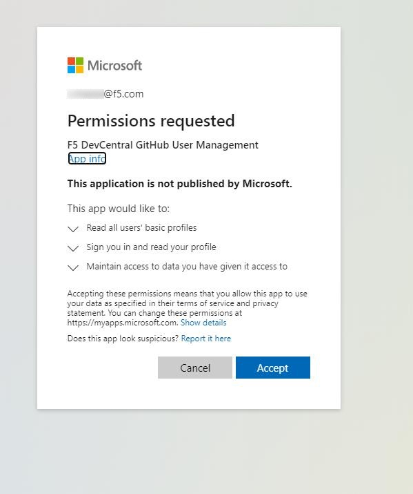
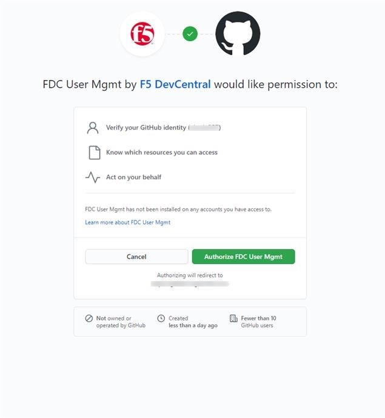
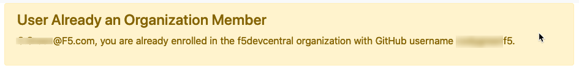
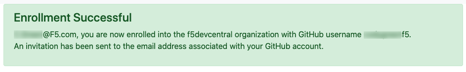

# Enrollment Instructions

This web application will help you enroll into the desired GitHub organization.  

## Authentication
The application will require authentication against your Azure Active Directory instance and GitHub.  For each identity provider, you will see an OAuth Scope request which will need to be approved. 

## Enroll
Once you are authenticated against Azure AD and GitHub you will see an enroll button:

If you are already a member of the GitHub organization you'll receive a warning stating such:

If you are not a member of the GitHub organziation, you'll receive a success notice telling you to check your email address associated with your GitHub account for an email invite to the requested organization. 
